#  Preview: Vasculature CCF Visualization

HuBMAP Atlas Previews demonstrate functionality and resources that will become available in future releases. Previews may rely on externally hosted data or analysis results that were generated with processing pipelines that are not yet integrated into the HuBMAP Data Portal infrastructure.

### Description

This preview showcases a novel visualization in support of a vasculature-based common coordinate system (VCCF), [see paper](https://doi.org/10.3389/fcvm.2020.00029) on “Considerations for Using the Vasculature as a Coordinate System to Map All the Cells in the Human Body”.

Experimental data from the “Human Digital Twin: Automated Cell Type Distance Computation and 3D Atlas Construction in Multiplexed Skin Biopsies” paper, bioarxiv #, is used to compute distances of different cell types to the nearest blood vessel using 3D volumes of digital skin biopsy data generated using multiplexed imaging of sequential skin sections from younger and older patients (n=12; 22-72 years). Skin biopsies were collected from patients from different anatomical regions and different sun exposure effects (mild, moderate and marked). Samples underwent multiplexed imaging with 18 biomarkers covering nine cell types (epithelial, fibroblast, immune cells (macrophage, T-helper, T-killer, T-reg), endothelial, myoepithelial and nerve) markers of UV damage (p53, DDB2) and proliferation (Ki67). Following classification of cells into epithelial, endothelial, immune and markers of damage, the tissue data was reconstructed into 3D volumes. The reconstructed 3D cell data was used to compute distance distributions and network layouts of major immune cells to the nearest blood vessel in support of a vasculature based common coordinate framework and compared across age groups. Further, analysis of cell damage and proliferation markers (p53, Ki67 and DDB2) in the epithelial layer and their distance provided new insights into the effects of aging on skin.

### Atlas Details

Vascular pathways in human have been studied in much detail. Constructing a vasculature-based coordinate system (doi: 10.3389/fcvm.2020.00029) makes sense biologically as almost every living cell must be within a small distance to a blood vessel (100µm to 1mm, depending on the tissue) in order to receive oxygen. This Preview showcases a 3D interactive visualization of distances from cell nuclei of different cell types different cell types (T-regulatory, T-helper, and macrophages/CD68) to vasculature and skin surface tissue cells and compute violin plot comparisons across donor groups. 

The 3D visualization shows Region 5 for an UV exposed sample from the neck of a 33-year-old female (HuBMAP sample ID: HBM499.VJVR.265). Segmented blood vessels are rendered in red, T-regulatory cells in cyan, T-helper cells in blue, T-killer cells in dark red, and macrophages in yellow. The closest distance between an immune cell and a blood vessel is indicated by a gray line. The 3D visualization is interactive and available for all 10 tissue blocks used in the paper. Distance distributions for all three cell types are given below the 3D visualization.  

### Experimental Data Details

The experimental skin data used here is detailed in “Human Digital Twin: Automated Cell Type Distance Computation and 3D Atlas Construction in Multiplexed Skin Biopsies” **bioarxiv #.**

### Contributors
**Skin Data:** Soumya Ghose, Chrystal Chadwick, Elizabeth McDonough, Sanghee Cho, Johnhan Ho, Arivarasan Karunamurthy, Anup Sood, Yousef Al-Kofahi, Louis Falo & Fiona Ginty

**Vasculature CCF Visualization:** Yingnan Ju & Katy Börner

### Attribution

| Group  | Creater                          |
|--------|----------------------------------|
| RTI-GE | Fiona Ginty (fiona.ginty@ge.com) |
| MC-IU  | Katy Börner (katy@indiana.edu)   |

### Visualization

  <ul class="nav nav-tabs">
    <li class="active"><a data-toggle="tab" href="#region1">Region 1</a></li>
    <li><a data-toggle="tab" href="#region2">Region 2</a></li>
    <li><a data-toggle="tab" href="#region3">Region 3</a></li>
    <li><a data-toggle="tab" href="#region4">Region 4</a></li>
    <li><a data-toggle="tab" href="#region5">Region 5</a></li>
    <li><a data-toggle="tab" href="#region7">Region 7</a></li>
    <li><a data-toggle="tab" href="#region8">Region 8</a></li>
    <li><a data-toggle="tab" href="#region9">Region 9</a></li>
    <li><a data-toggle="tab" href="#region10">Region 10</a></li>
    <li><a data-toggle="tab" href="#region11">Region 11</a></li>
    <li><a data-toggle="tab" href="#violincell">Violin Cell</a></li>
    <li><a data-toggle="tab" href="#violinCellAll">Violin Cell All Region</a></li>
    <li><a data-toggle="tab" href="#ViolinDamage">Violin Damage</a></li>
     <li><a data-toggle="tab" href="#ViolinDamageAll">Violin Damage All Region</a></li>
  </ul>

  

    

      <h3>Region 1</h3>
      <a target="_blank" href="https://juyingnan.github.io/vccf_visualization.io/html/region_1.html" >
      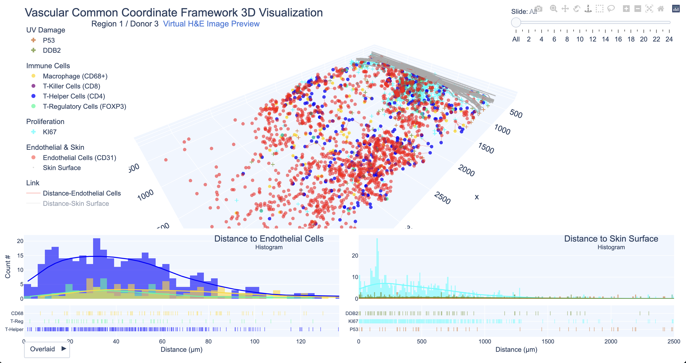
        </a>
      
 Open the visualization in <a target="_blank" href="https://juyingnan.github.io/vccf_visualization.io/html/region_1.html" >new window.</a>  
    

    

      <h3>Region 2</h3>
        <a target="_blank" href="https://juyingnan.github.io/vccf_visualization.io/html/region_2.html" >
      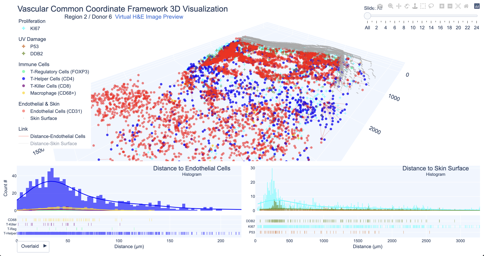
        </a>
        
 Open the visualization in <a target="_blank" href="https://juyingnan.github.io/vccf_visualization.io/html/region_2.html" >new window.</a>
  

    

      <h3>Region 3</h3>
        <a target="_blank" href="https://juyingnan.github.io/vccf_visualization.io/html/region_3.html" >
      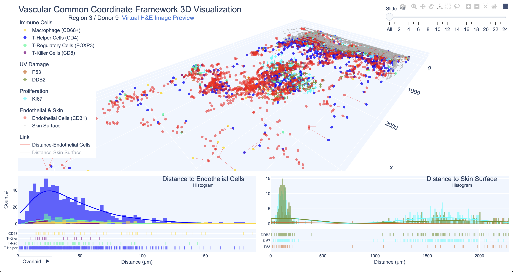
        </a>
        
 Open the visualization in <a target="_blank" href="https://juyingnan.github.io/vccf_visualization.io/html/region_3.html" >new window.</a>
    

    

      <h3>Region 4</h3>
        <a target="_blank" href="https://juyingnan.github.io/vccf_visualization.io/html/region_4.html" >
      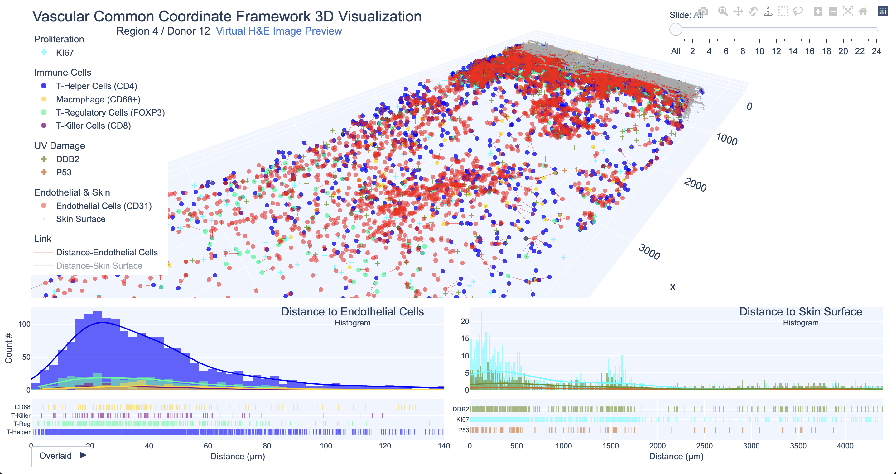
        </a>
        
 Open the visualization in <a target="_blank" href="https://juyingnan.github.io/vccf_visualization.io/html/region_4.html" >new window.</a>
    

    

      <h3>Region 5</h3>
        <a target="_blank" href="https://juyingnan.github.io/vccf_visualization.io/html/region_5.html" >
      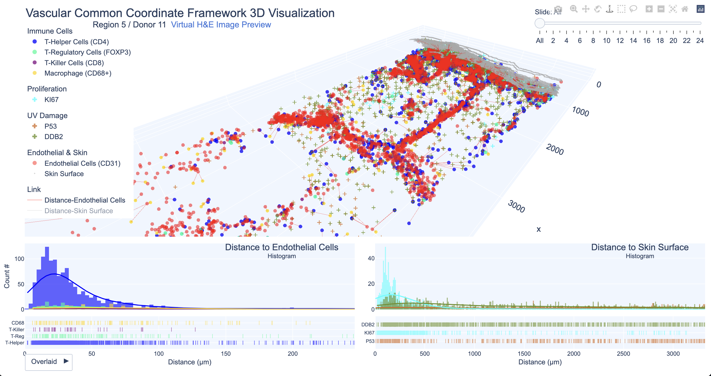
        </a>
        
 Open the visualization in <a target="_blank" href="https://juyingnan.github.io/vccf_visualization.io/html/region_5.html" >new window.</a>
    

    

      <h3>Region 7</h3>
        <a target="_blank" href="https://juyingnan.github.io/vccf_visualization.io/html/region_7.html" >
      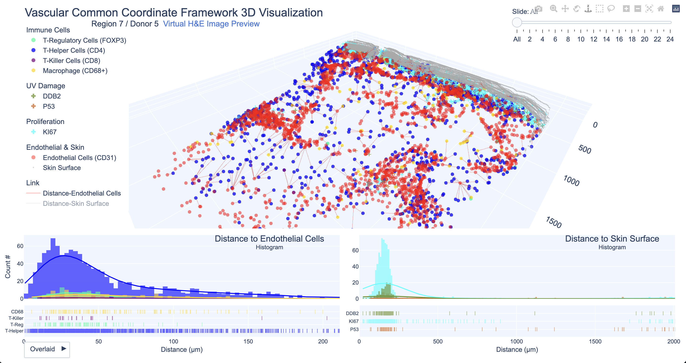
        </a>
        
 Open the visualization in <a target="_blank" href="https://juyingnan.github.io/vccf_visualization.io/html/region_7.html" >new window.</a>
    

    

      <h3>Region 8</h3>
        <a target="_blank" href="https://juyingnan.github.io/vccf_visualization.io/html/region_8.html" >
      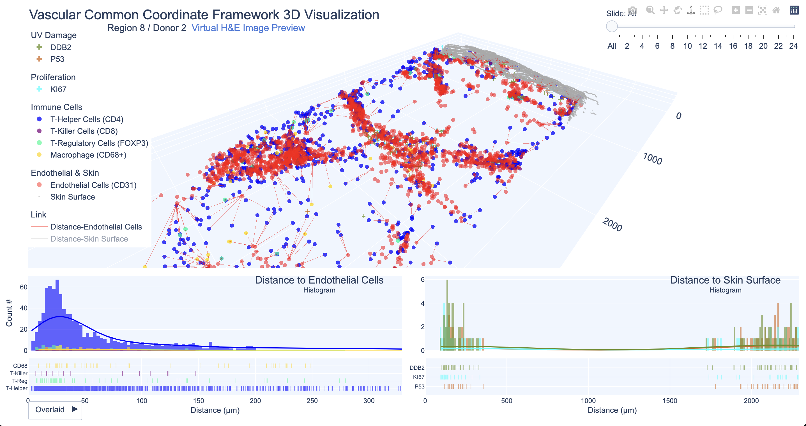
        </a>
        
 Open the visualization in <a target="_blank" href="https://juyingnan.github.io/vccf_visualization.io/html/region_8.html" >new window.</a>
    

    

      <h3>Region 9</h3>
        <a target="_blank" href="https://juyingnan.github.io/vccf_visualization.io/html/region_9.html" >
      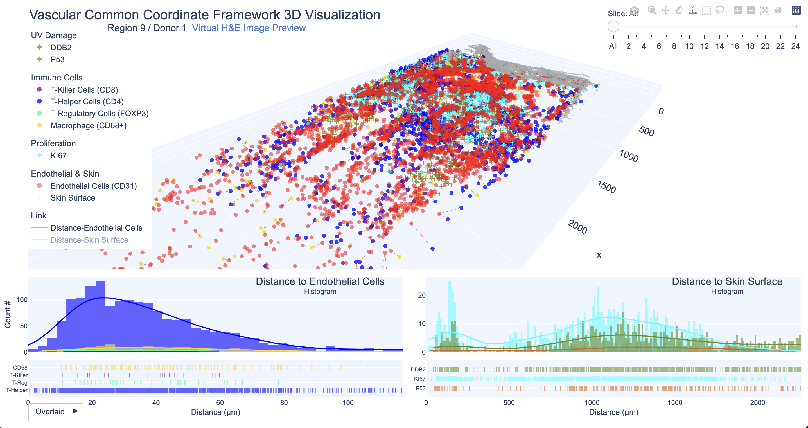
        </a>
        
 Open the visualization in <a target="_blank" href="https://juyingnan.github.io/vccf_visualization.io/html/region_9.html" >new window.</a>
    

    

      <h3>Region 10</h3>
        <a target="_blank" href="https://juyingnan.github.io/vccf_visualization.io/html/region_10.html" >
      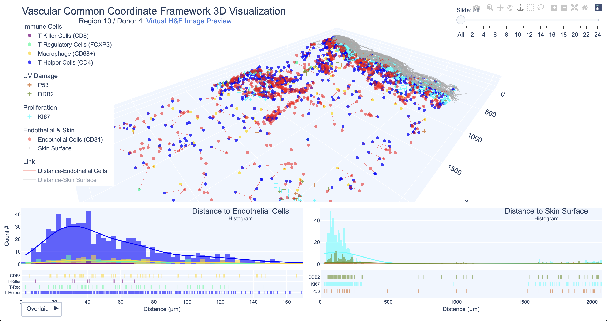
        </a>
        
 Open the visualization in <a target="_blank" href="https://juyingnan.github.io/vccf_visualization.io/html/region_10.html" >new window.</a>
    

    

      <h3>Region 11</h3>
        <a target="_blank" href="https://juyingnan.github.io/vccf_visualization.io/html/region_11.html" >
      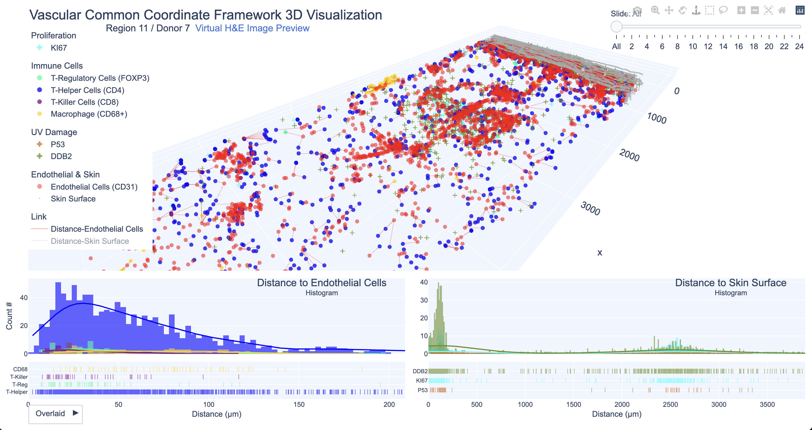
        </a>
        
 Open the visualization in <a target="_blank" href="https://juyingnan.github.io/vccf_visualization.io/html/region_11.html" >new window.</a>
    

    

        <h3>Violin Cell</h3>
        <a target="_blank" href="https://juyingnan.github.io/vccf_visualization.io/html/violin_cell.html" >
        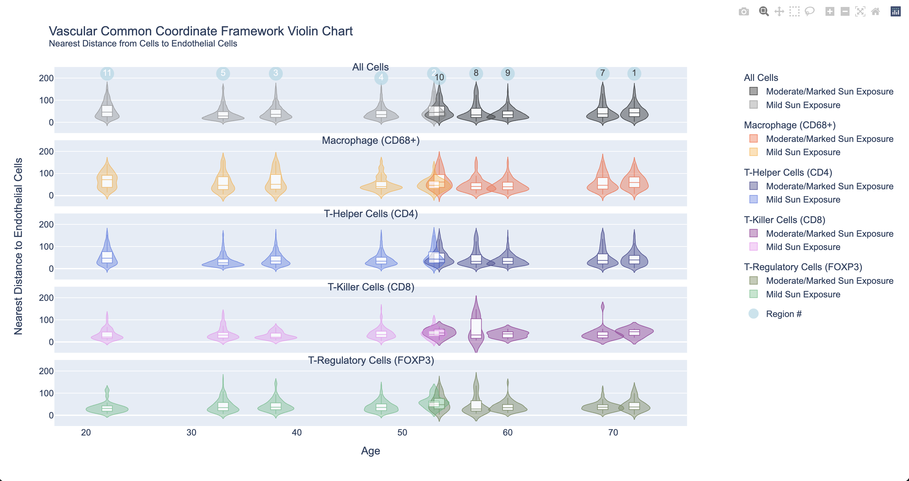
        </a>
        
 Open the visualization in <a target="_blank" href="https://juyingnan.github.io/vccf_visualization.io/html/violin_cell.html" >new window.</a>
    

    

        <h3>Violin Cell All Region</h3>
        <a target="_blank" href="https://juyingnan.github.io/vccf_visualization.io/html/violin_cell_all.html" >
        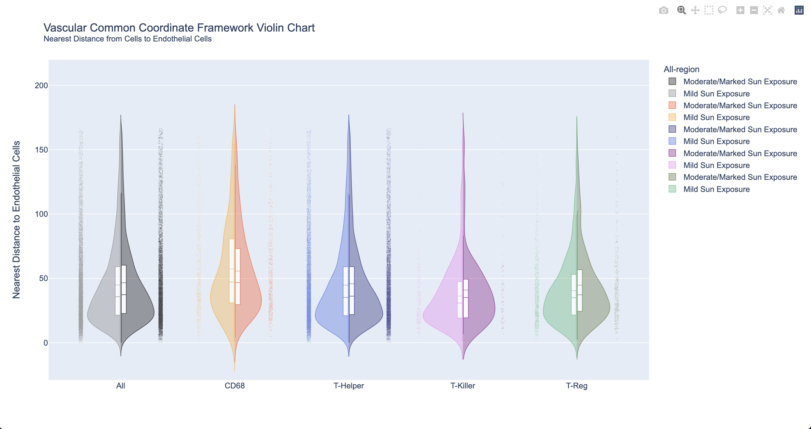
        </a>
        
 Open the visualization in <a target="_blank" href="https://juyingnan.github.io/vccf_visualization.io/html/violin_cell_all_region.html" >new window.</a>
    

    

        <h3>Violin Damage</h3>
        <a target="_blank" href="https://juyingnan.github.io/vccf_visualization.io/html/violin_damage.html" >
        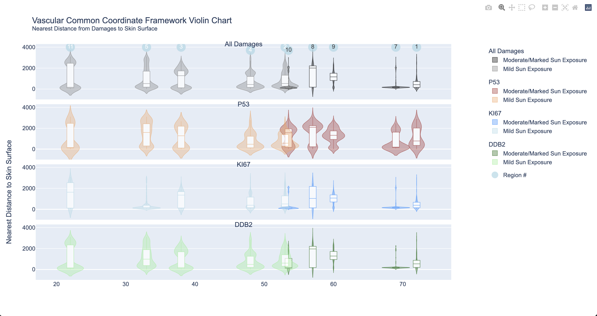
        </a>
        
 Open the visualization in <a target="_blank" href="https://juyingnan.github.io/vccf_visualization.io/html/violin_damage.html" >new window.</a>
    

    

        <h3>Violin Damage All Region</h3>
        <a target="_blank" href="https://juyingnan.github.io/vccf_visualization.io/html/violin_damage_all.html" >
        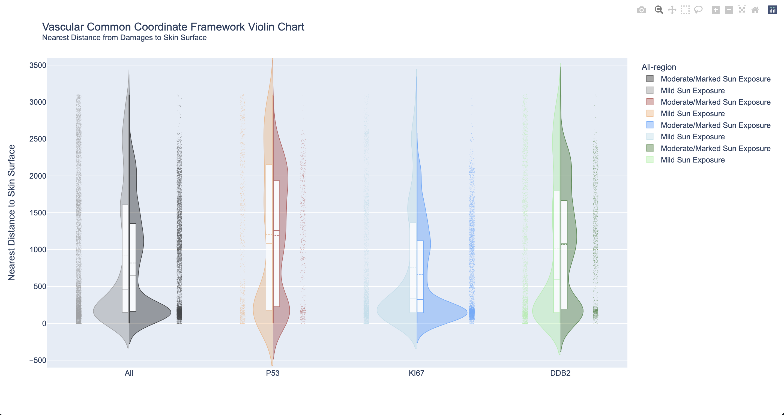
        </a>
        
 Open the visualization in <a target="_blank" href="https://juyingnan.github.io/vccf_visualization.io/html/violin_damage_all_region.html" >new window.</a>
    

Try all the 10 skin samples [here](https://juyingnan.github.io/vccf_visualization.io).